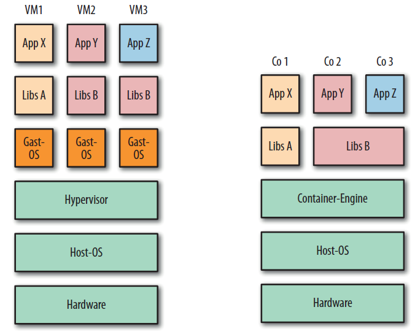

Container 
---------

VM vs. Container Umgebung. 

Quelle: Docker Adrian Mouat, dpunkt.verlag

- - -

Container ändern die Art und Weise, wie wir Software entwickeln, verteilen und laufen lassen, grundlegend.

Entwickler können Software lokal bauen, die woanders genauso laufen wird – sei es ein Rack in der IT Abteilung,
der Laptop eines Anwenders oder ein Cluster in der Cloud. 

Administratoren können sich auf die Netzwerke, Ressourcen und die Uptime konzentrieren und müssen weniger Zeit mit dem Konfigurieren von Umgebungen und dem Kampf mit Systemabhängigkeiten verbringen.

### Merkmale

* Container teilen sich Ressourcen mit dem Host-Betriebssystem.
* Container können im Bruchteil einer Sekunde gestartet und gestoppt werden.
* Anwendungen, die in Containern laufen, verursachen wenig bis gar keinen Overhead
* Container sind Portierbar, fertig mit "Aber bei mir auf dem Rechner lief es doch!"
* Container sind leichtgewichtig, d.h. es können dutzende Parallel betrieben werden.
* Container sind Cloud "ready"!

### Links

* [Open Container Initiative](https://www.opencontainers.org/)
* [Docker Data Center: Kontrolle über den gesamten Lebenszyklus von Container-Anwendungen](https://m.heise.de/developer/meldung/Docker-Data-Center-Kontrolle-ueber-den-gesamten-Lebenszyklus-von-Container-Anwendungen-3116267.html)
