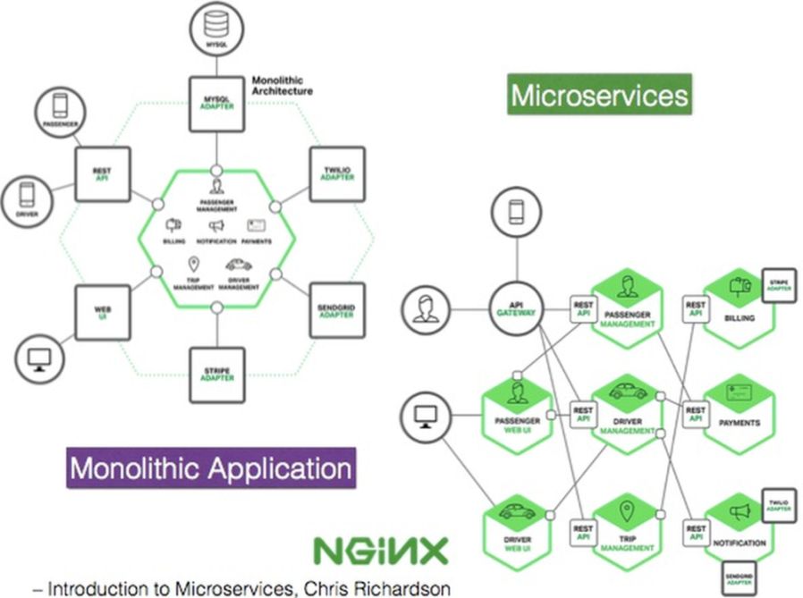

Microservices
-------------

- - - 

Einer der größten Anwendungsfälle und die stärkste treibende Kraft hinter dem Aufstieg
von Containern sind Microservices.

Microservices sind ein Weg, Softwaresysteme so zu entwickeln und zu kombinieren, dass sie aus kleinen, unabhängigen Komponenten bestehen, die untereinander über das Netz interagieren. Das steht im Gegensatz zum klassischen, monolithischen Weg der Softwareentwicklung, bei dem es ein einzelnes, großes Programm gibt.

Wenn solch ein Monolith dann skaliert werden muss, kann man sich meist nur dazu entscheiden, vertikal zu skalieren (scale up), zusätzliche Anforderungen werden in Form von mehr RAM und mehr Rechenleistung bereitgestellt. Microservices sind dagegen so entworfen, dass sie horizontal skaliert werden können (scale out), indem zusätzliche Anforderungen durch mehrere Rechner verarbeitet werden, auf die die Last verteilt werden kann. 

In einer Microservices-Architektur ist es möglich, nur die Ressourcen zu skalieren, die für einen bestimmten Service benötigt werden, und sich
damit auf die Flaschenhälse des Systems zu beschränken. In einem Monolith wird alles oder gar nichts skaliert, was zu verschwendeten Ressourcen führt.

**Links**

* [microservices.io](http://microservices.io/index.html)
* [Microservices – ein Ansatz zur Softwaremodularisierung](https://news.digicomp.ch/de/2018/03/15/microservices-ein-ansatz-zur-softwaremodularisierung/)