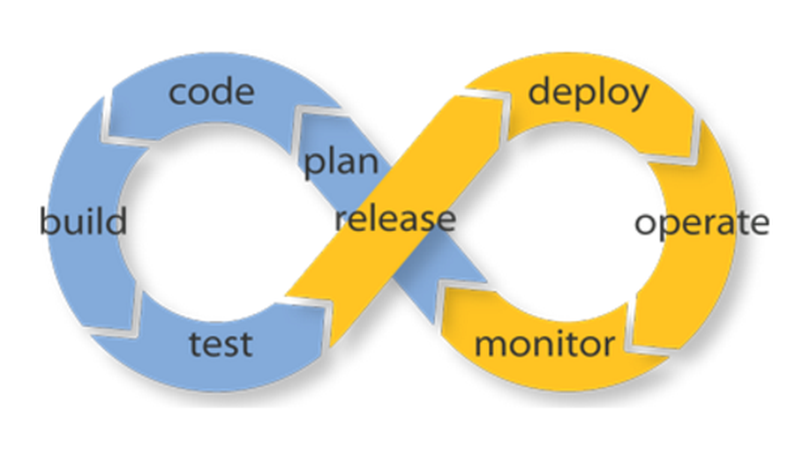

Kontinuierliche Integration
---------------------------

Quelle: <a href="https://www.apicasystem.com/blog/top-5-tips-avoid-integration-hell-continuous-integration/">Top 5 Tips to Avoid “Integration Hell” with Continuous Integration</a>

- - -

[Kontinuierliche Integration](https://de.wikipedia.org/wiki/Kontinuierliche_Integration) (auch fortlaufende oder permanente Integration; englisch continuous integration) ist ein Begriff aus der Software-Entwicklung, der den Prozess des fortlaufenden Zusammenfügens von Komponenten zu einer Anwendung beschreibt. 

Das Ziel der kontinuierlichen Integration ist die Steigerung der Softwarequalität. 

Typische Aktionen sind das Übersetzen und Linken der Anwendungsteile, prinzipiell können aber auch beliebige andere Operationen zur Erzeugung abgeleiteter Informationen durchgeführt werden.

Üblicherweise wird dafür nicht nur das Gesamtsystem neu gebaut, sondern es werden auch automatisierte Tests durchgeführt und Software Metriken zur Messung der Softwarequalität erstellt. 
 
Der gesamte Vorgang wird automatisch ausgelöst durch Einchecken in die Versionsverwaltung.

**Grundsätze**

* Gemeinsame Codebasis
* Automatisierte Übersetzung
* Kontinuierliche Test-Entwicklung
* Häufige Integration
* Integration in den Hauptbranch
* Kurze Testzyklen
* Gespiegelte Produktionsumgebung
* Einfacher Zugriff
* Automatisiertes Reporting

Details siehe [Kontinuierliche Integration](https://de.wikipedia.org/wiki/Kontinuierliche_Integration)

