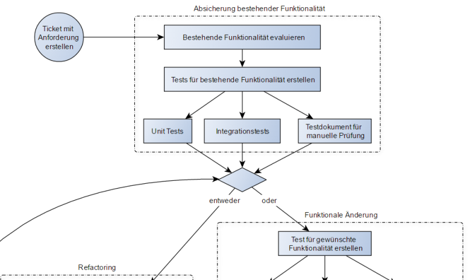

Unittest
--------

Ausschnitt aus testgetriebener Entwicklungsprozess

Quelle: <a href="https://de.wikipedia.org/wiki/Testgetriebene_Entwicklung">Testgetriebene Entwicklung</a>

- - -

Ein [Modultest](https://de.wikipedia.org/wiki/Modultest) (auch Komponententest oder oft vom engl. unit test als Unittest bezeichnet) wird in der Softwareentwicklung angewendet, um die funktionalen Einzelteile (Module) von Computerprogrammen zu testen, d. h., sie auf korrekte Funktionalität zu prüfen.

### Links

* [Testgetriebene Entwicklung](https://de.wikipedia.org/wiki/Testgetriebene_Entwicklung)
* [Tests in Vagrantfile](https://github.com/mc-b/devops/tree/master/vagrant/tests)