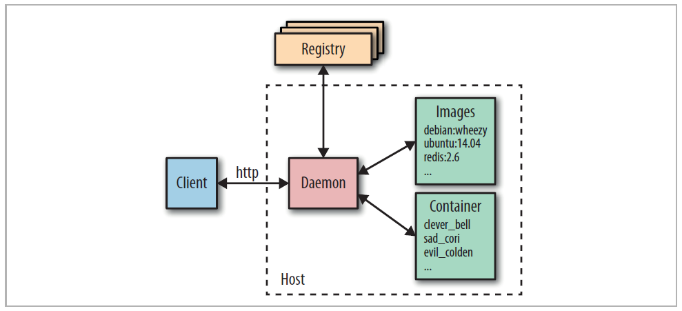

Architektur
-----------

Übersicht über die wichtigsten Docker-Komponenten

Quelle: Docker Adrian Mouat, dpunkt.verlag

- - -

### Komponenten

**Docker Deamon**

* Erstellen, Ausführen und Überwachen der Container
* Bauen und Speichern von Images 

Der Docker Daemon wird  normalerweise durch das Host-Betriebssystem gestartet.

**Docker Client**

* Docker wird über die Kommandozeile [(CLI)](https://de.wikipedia.org/wiki/Kommandozeile), mittels des Docker Clients, bedient.
* Kommuniziert per HTTP REST mit dem Docker Daemon.

Da die gesamte Kommunikation über HTTP abläuft, ist es einfach, sich mit entfernten Docker Daemons zu verbinden und Bindings an
Programmiersprachen zu entwickeln. 

**Images**

* Images sind gebuildete Umgebungen welche als Container gestartet werden können. 
* Images sind nicht veränderbar, sondern können nur neu gebuildet werden.
* Images bestehen aus Namen und Version (TAG), z.B. `ubuntu:16.04`. Wird keine Version Angegeben wird automatisch `:latest` angefügt.

**Container**

* Container sind die ausgeführten Images.
* Ein Image kann beliebig oft als Container ausgeführt werden.
* Container bzw. deren Inhalte können verändert werden, dazu werden sogenannte Union File Systems verwendet. Welche nur
die Änderungen zum Original Image speichern.

**Docker Registry**

* In Docker Registries werden Images abgelegt und verteilt. 

Die Standard-Registry ist der [Docker Hub](https://hub.docker.com/), auf dem tausende öffentlich verfügbarer Images zur Verfügung stehen, aber auch "offizielle" Images.

Viele Organisationen und Firmen nutzen eigene Registries, um kommerzielle oder "private" Images zu hosten, aber auch um den Overhead zu vermeiden, der mit dem Herunterladen von Images über das Internet einhergeht. 
