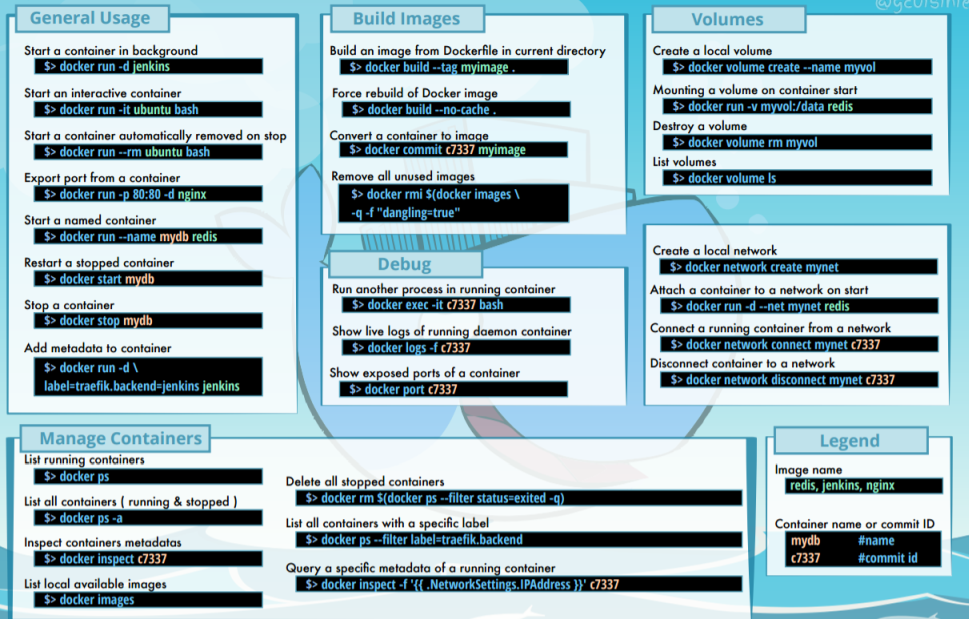

Befehle
-------

Quelle: <a href="https://dockerlux.github.io/pdf/cheat-sheet-v2.pdf" target="_blank">Docker Cheat Sheet</a>

- - -

### [docker run](https://docs.docker.com/engine/reference/run/)

* Ist der Befehl zum Starten neuer Container. 
* Der bei weitem komplexesten Befehl, er unterstützt eine lange Liste möglicher Argumente. 
* Ermöglicht es dem Anwender, zu konfigurieren, wie das Image laufen soll, Dockerfile-Einstellungen zu überschreiben, Verbindungen zu konfigurieren und Berechtigungen und Ressourcen für den Container zu setzen.

**Tip**: [VM mit Docker](https://github.com/mc-b/devops/tree/master/docker) aufsetzen und Befehle live austesten.

Standard Test

    docker run hello-world

Starten einen Container mit einer Interaktiven Shell (interactive, tty)
 
    docker run -it ubuntu /bin/bash

Startet einen Container im Hintergrund (detach) läuft

    docker run -d ubuntu sleep 20

Startet einen Container im Hintergrund und löscht (remove) diesen nach Beendigung des Jobs

    docker run -d --rm ubuntu sleep 20

Startet einen Container im Hintergrund und legt eine Datei an
 
    docker run -d ubuntu touch /tmp/lock    
    
Startet einen Container gibt das ROOT Verzeichnis nach STDOUT aus.

    docker run -it ubuntu ls -l

### [docker ps](https://docs.docker.com/engine/reference/commandline/ps/)

* Gibt einen Überblick über die aktuellen Container, wie zum Beispiel Namen, IDs und Status.

Aktive Container anzeigen

    docker ps

Aktive und Beendete Container anzeigen (all)

    docker ps -a

Nur Id's ausgeben (all, quit)

    docker ps -a -q

### [docker images](https://docs.docker.com/engine/reference/commandline/images/)

* Gibt eine Liste lokaler Images aus, wobei Informationen zu Repository-Namen, Tag-Namen und Größe enthalten sind.

Lokale Images ausgeben

    docker images
    
Alternative

    docker image ls

### [docker rm](https://docs.docker.com/engine/reference/commandline/rm/) und [docker rmi](https://docs.docker.com/engine/reference/commandline/rmi/)    

* **docker rm:** Entfernt einen oder mehrere Container. Gibt die Namen oder IDs erfolgreich gelöschter Container zurück.
* **docker rmi:** Löscht das oder die angegebenen Images. Diese werden durch ihre ID oder Repository- und Tag-Namen spezifiziert.

Docker Container löschen

    docker rm <name>

Alle beendeten Container löschen

    docker rm $(docker ps -a -q)

Alle Container, auch aktive, löschen

    docker rm -f $(docker ps -a -q)

Docker Image löschen

    docker rmi ubuntu

Zwischenimages löschen (haben keinen Namen)

    docker rmi $(docker images -q -f dangling=true)

### [docker start](https://docs.docker.com/engine/reference/commandline/start/)

* Startet einen (oder mehrere) gestoppten Container. Kann genutzt werden, um einen Container neu zu starten, der beendet wurde, oder um einen Container zu starten, der mit [docker create](https://docs.docker.com/engine/reference/commandline/create/) erzeugt, aber nie gestartet wurde.

Docker Container neu starten, die Daten bleiben erhalten

    docker start <id>

## Container stoppen, killen

* **[docker stop](https://docs.docker.com/engine/reference/commandline/stop/)** Stoppt einen oder mehrere Container (ohne sie zu entfernen). Nach dem Aufruf von docker stop für einen Container wird er in den Status »exited« überführt.
* **[docker kill](https://docs.docker.com/engine/reference/commandline/kill/):** Schickt ein Signal an den Hauptprozess (PID 1) in einem Container. Standardmäßig wird SIGKILL gesendet, womit der Container sofort stoppt.

### Informationen Containern

* **[docker logs](https://docs.docker.com/engine/reference/commandline/logs/):** Gibt die "Logs" für einen Container aus. Dabei handelt es sich einfach um alles, was innerhalb des Containers nach STDERR oder STDOUT geschrieben wurde.
* **[docker inspect](https://docs.docker.com/engine/reference/commandline/inspect/):** Gibt umfangreiche Informationen zu Containern oder Images aus. Dazu gehören die meisten Konfigurationsoptionen und Netzwerkeinstellungen sowie Volumes-Mappings.
* **[docker diff](https://docs.docker.com/engine/reference/commandline/diff/):** Gibt die Änderungen am Dateisystem des Containers verglichen mit dem Image aus, aus dem er gestartet wurde.
* **[docker top](https://docs.docker.com/engine/reference/commandline/top/):** Gibt Informationen zu den laufenden Prozessen in einem angegebenen Container
aus.

### Links

* [Docker Dokumentation](https://docs.docker.com/)
* [Docker Cheat Sheet](https://dockerlux.github.io/pdf/cheat-sheet-v2.pdf)
    

