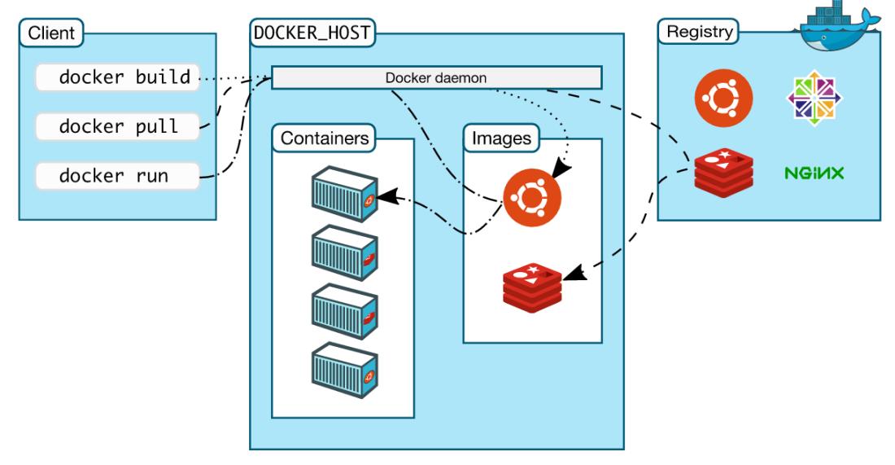

Bereitstellen von Images
------------------------

Übersicht über die wichtigsten Docker-Komponenten

Quelle: <a href="https://docs.docker.com/engine/understanding-docker/">Docker Overview</a>

- - -

Haben Sie Ihre Images erstellt, werden Sie sie auch bereitstellen wollen – sei es Ihren Kollegen, auf Continuous-Integration-Servern oder für Endanwender.

Es gibt viele verschiedene Möglichkeiten, Images bereitzustellen: Sie können sie aus Dockerfiles neu bauen, aus einer Registry `docker pull` ziehen oder sie mit `docker load` aus einer Archivdatei installieren.

### Namensgebung für Images 

Images bestehen aus Namen und Version (TAG), z.B. `ubuntu:16.04`. Wird keine Version Angegeben wird automatisch `:latest` angefügt.

Beim Bereitstellen von Images ist es sehr wichtig, beschreibende und exakte Namen und Tags einzusetzen. 

Imagenamen und -Tags werden beim Bauen der Images oder durch den Befehl `docker tag` gesetzt:

	docker build -t mysql .
	docker build -t mysql:1.0 .
	docker tag mysql username/mysql 
	
Tag-Namen müssen sich an ein paar Regeln halten. Sie müssen aus Groß- und Kleinbuchstaben, Zahlen oder den Symbolen . und - bestehen. Sie dürfen nicht
länger als 128 Zeichen sein. Beim ersten Zeichen darf es sich nicht um ein . oder - handeln.

**Namen von Repositories und Tags sind ausgesprochen wichtig, wenn Sie einen Entwicklungs-Workflow aufbauen. Docker hat nur sehr wenige Regeln für gültige Namen und erlaubt es jederzeit, Namen zu erstellen oder zu löschen. Es liegt also am Entwicklungsteam, ein vernünftiges Namensschema zu entwerfen und umzusetzen.**	

**Warnung vor dem latest-Tag**

Docker nutzt latest es als Standardwert, wenn kein Tag vergeben wurde, darüber hinaus hat es aber
keine spezielle Bedeutung. Viele Repositories verwenden es als Alias für das aktuellste stabile Image, dabei handelt es sich aber nur um eine Konvention,
die durch keinerlei technische Maßnahmen erzwungen wird.

Bezieht sich ein docker run oder docker pull auf einen Imagenamen ohne Tag, wird Docker das Image verwenden, das mit latest gekennzeichnet
ist. Gibt es kein solches Image, wird ein Fehler ausgegeben.

### Links

* [Setup Local Repository](https://www.unixmen.com/setup-local-repository-in-ubuntu-15-04/)
* [Vagrant Hub einrichten](https://github.com/hollodotme/Helpers/blob/master/Tutorials/vagrant/self-hosted-vagrant-boxes-with-versioning.md)
* [Offizielle Docker Hub 2.x Registry](https://docs.docker.com/registry/)
* [Docker Hub](https://www.digitalocean.com/community/tutorials/how-to-set-up-a-private-docker-registry-on-ubuntu-14-04)
* [Docker Hub 2.0](https://github.com/docker/distribution)
* [Docker Hub Installation auf Ubuntu herunterscrollen](http://www.informit.com/articles/article.aspx?p=2464012)