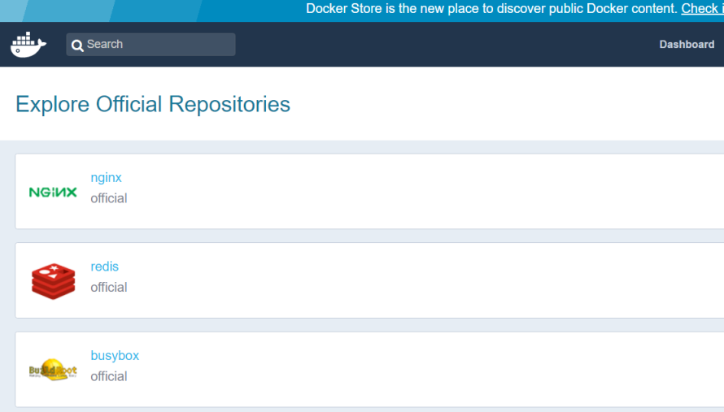

Docker Hub
----------

[Docker Hub](https://hub.docker.com/)

- - -

Die einfachste Möglichkeit, Ihre Images bereitzustellen, ist der Einsatz des Dockers Hub. 

Bei diesem handelt es sich um die von Docker Inc. angebotene Online-Registry. 

Der Hub ermöglicht kostenlose Repositories für öffentliche Images, die Anwender können aber auch für private Repositories bezahlen.

### Vorgehen

Um seine eigenen Images auf Docker Hub hochzuladen ist wie folgt vorzugehen

* Account auf [Docker Hub](https://hub.docker.com/) eröffnen.

* Imagenamen mit Usernamen, laut Account auf Docker Hub, taggen

	docker tag mysql username/mysql 
	
* Image hochladen

	docker push username/mysql
	
* Dashboard auf Docker Hub anwählen und Image beschreiben.

### Weitere Befehle

Suchen nach Images auf Docker Hub

	docker search mysql
	
Image herunterladen, z.B. um Build Zeiten zu vermindern

	docker pull ubuntu

