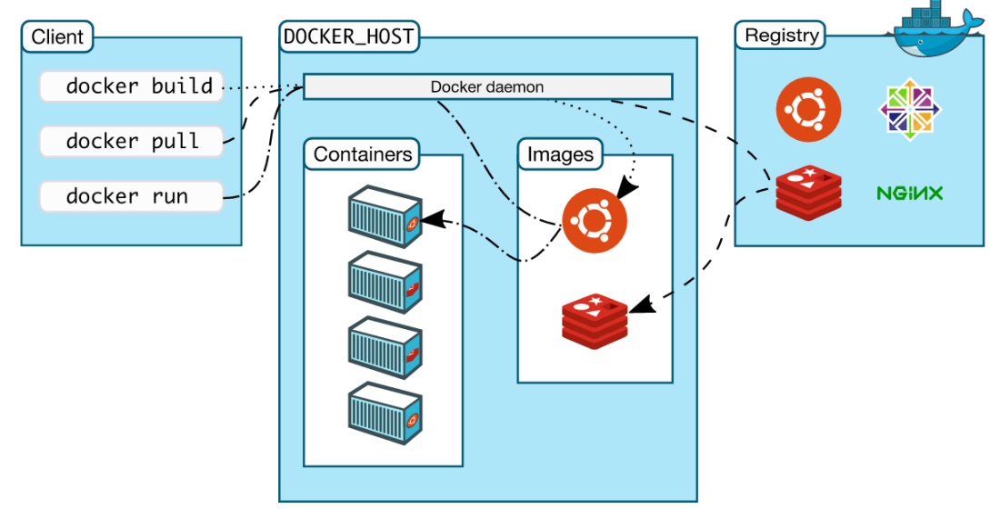

Private Registry
----------------

Übersicht über die wichtigsten Docker-Komponenten

Quelle: <a href="https://docs.docker.com/engine/understanding-docker/">Docker Overview</a>

- - -

Es gibt neben dem Docker Hub noch ein paar weitere Möglichkeiten. 

Sie können alles manuell machen, indem Sie Images exportieren und importieren oder einfach Images auf jedem Docker Host aus Dockerfiles neu bauen. 

Beide Lösungen sind suboptimal: Das immer neue Bauen aus Dockerfiles ist langsam und kann auf den verschiedenen Hosts zu unterschiedlichen Images führen, während das Exportieren und Importieren von Images knifflig und fehleranfällig sein kann.

Die verbleibende Möglichkeit ist, eine andere Registry zu verwenden, die entweder von Ihnen selbst oder durch eine andere Firma gehostet werden kann.

### Private Docker Registry einrichten

	sudo docker pull registry:2
	
	sudo docker run -d -p 5000:5000 --restart=always --name registry \
	  -v /var/spool/docker-registry:/var/lib/registry registry:2
	
### Docker Client auf Registry zusteuern

Die Docker Clients steuern per default auf [Docker Hub](https://hub.docker.com/) zu. Damit sie mit unserer Registry arbeiten
kann ist die Datei `/etc/docker/daemon.json` mit folgendem Inhalt zu erstellen und docker neu zu starten `sudo docker restart`

	{ "insecure-registries":["{{config.docker}}:5000"] }
	
Anschliessend können die vorhanden Images von unserer lokalen Docker Registry geholt `pull` werden:

	docker pull {{config.docker}}:5000/ubuntu

oder geschrieben `push` werden

	docker tag ubuntu {{config.docker}}:5000/myubuntu
	docker push {{config.docker}}:5000/myubuntu

`{{config.docker}}` durch installierten Server ersetzen.

[Quelle](https://github.com/docker/distribution/issues/1874)	

