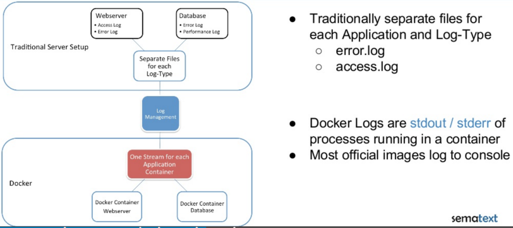

Einleitung
----------

Traditionelles Logging vs. Docker Logging

Quelle: <a href="http://www.slideshare.net/sematext/docker-logging-webinar">Docker Logging Webinar</a>

- - -

Ein effektives Überwachen und Protokollieren laufender Container ist ausgesprochen wichtig, wenn Sie ein nichttriviales System am Laufen halten und Probleme
effektiv debuggen wollen. 

Bei einer Microservices-Architektur werden Protokollieren und Überwachen aufgrund der größeren Zahl von Rechnern sogar noch wichtiger. 

Angesichts der kurzlebigen Natur von Containern kann es sein, dass ein gegebener Container zum Zeitpunkt des Debuggens gar nicht mehr existiert, was zentrale Logs unabdingbar macht.

### Links 

* [Docker Logging Webinar](http://www.slideshare.net/sematext/docker-logging-webinar)