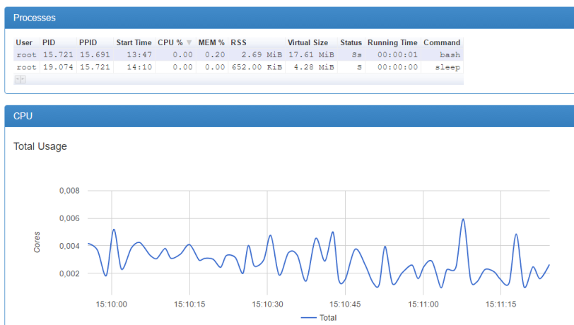

Überwachen und Benachrichtigen
------------------------------

Diagramm in cAdvisor zu Prozessen und CPU Last eines Containers 

- - -

In einem Microservices-System werden Sie vermutlich dutzende, wenn nicht gar hunderte oder tausende laufende Container nutzen. Beim Überwachen des Status
der Container und des Systems im Allgemeinen wollen Sie dabei so viel Hilfe wie möglich haben. 

Eine gute Monitoring-Lösung sollte auf einen Blick den Zustand des Systems zeigen und rechtzeitig warnen, wenn Ressourcen knapp werden (zum Beispiel Plattenplatz, CPU, Speicher). 

Außerdem wollen wir informiert werden, wenn etwas anfängt, schiefzulaufen (wenn zum Beispiel Requests mehrere Sekunden brauchen, bis sie verarbeitet sind).

###  Docker Tools

Docker bringt ein CLI-Tool `docker stats` mit grundlegender Funktionalität mit. Es liefert einen Live-Stream zum Ressourceneinsatz. Der Befehl erwartet den oder die Namen eines oder mehrerer Container und gibt dafür eine Reihe von statistischen Informationen aus – so ähnlich wie die Unix-Anwendung top.

	docker stats

### cAdvisor

cAdvisor (eine Abkürzung von Container Advisor) von Google ist das am häufigsten eingesetzte Monitoring-Tool für Docker. 

Es bietet einen grafischen Überblick über den Ressourceneinsatz und Performance-Metriken von Containern, die auf dem Host laufen.

Da cAdvisor selbst als Container zur Verfügung steht, können wir das Tool in kürzester Zeit zum Laufen bringen. Starten Sie den cAdvisor-Container einfach mit folgenden Argumenten:

	docker run -d --name cadvisor -v /:/rootfs:ro -v /var/run:/var/run:rw -v /sys:/sys:ro -v /var/lib/docker/:/var/lib/docker:ro -p 8080:8080 google/cadvisor:latest
	
Ist der Container hochgefahren, rufen Sie ihn mit Ihrem Browser [http://localhost:8080](http://localhost:8080) auf. 

### Links

* [docker stats](https://docs.docker.com/engine/reference/commandline/stats/)
* [cAdvisor](https://github.com/google/cadvisor)
* [Prometheus für Docker Cluster](https://prometheus.io/)