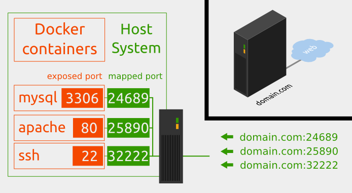

Ports
-----

Port Mapping 

Quelle: <a href="http://pierre-jean.baraud.fr/blog/2014/06/02/host-docker-containers/">Hosting Docker Containers</a>

- - -

Stellen Sie sich vor, Sie lassen einen Webserver in einem Container laufen. Wie können Sie dann der Außenwelt darauf Zugriff gewähren? 

Die Antwort ist, Ports mit den Befehlen -p oder -P zu »veröffentlichen«. Dieser Befehl leitet Ports auf den Host des Containers weiter.

**Beispiele:**

MySQL Container fix an Host Port 3306 weiterleiten

	docker run --rm -d -p 3306:3306 mysql
	
MySQL Container mit nächsten freien Port verbinden

	docker run --rm -d -P mysql 

**Erweiterung Dockerfile**

Um Ports an den Host bzw. das Netzwerk weiterzuleiten, sind diese im Dockerfile via `EXPOSE` einzutragen.

Beispiel MyQL:

	EXPOSE 3306

**Zugriff vom Host erlauben**

Um via Host auf den Container zuzugreifen sind ein paar Arbeiten zu erledigen.

Installation des MySQL Clients auf dem Host:

	sudo apt-get install mysql-client
	
Freigabe des Ports im Container, z.B. via Dockerfile

	RUN sed -i -e"s/^bind-address\s*=\s*127.0.0.1/bind-address = 0.0.0.0/" /etc/mysql/my.cnf
	
SQL Freigabe, via MySQL Client im Container einrichten:

	CREATE USER 'root'@'%' IDENTIFIED BY 'admin';
	GRANT ALL PRIVILEGES ON *.* TO 'root'@'%';
	FLUSH PRIVILEGES;
	
Sind alle Arbeiten durchgeführt sollte mit folgenden Befehl vom Host auf den MySQL Server, im Docker Container, zugegriffen werden können:

	mysql -uroot -padmin -h127.0.0.1

