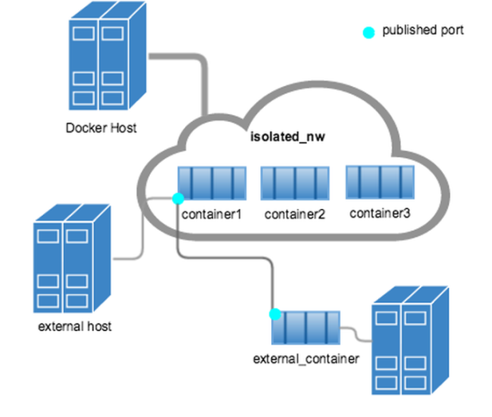

Docker container networking (neu)
---------------------------------

Bridge-Netzwerk

Quelle: <a href="https://docs.docker.com/engine/userguide/networking/">Docker container networking</a>

- - -

Neu können "Netzwerke" getrennt von Containern erstellt und verwaltet werden.

Wenn man Container startet, lassen sie sich einem bestehenden Netzwerk zuweisen, so dass sie sich direkt mit anderen Containern
im gleichen Netzwerk austauschen können.

Standardmässig werden folgende Netzwerke eingerichtet:

* **bridge:** Das Standard Netzwerk wo gemappte Ports gegen aussen sichtbar sind
* **none:** Für Container ohne Netzwerkschnittstelle
* **host:** Fügt den Containern dem internen Host Netzwerk hinzu, Ports sind nicht nach aussen sichtbar.  

**Hinweis** das `bridge` Netzwerk funktioniert, wie bisher, mittels Verlinken von Containern. 

### Befehle

**Auflisten des bestehenden Netzwerke**

	docker network ls

Detailinformationen, inkl. der Laufenden Container zu einem Netzwerk

	docker network inspect bridge
	
**Container erstellen ohne Netzwerkschnittstelle**

	docker run --network=none -it --name c1 --rm busybox
	# Kontrollieren im Container 
	ifconfig	
	
**Container erstellen mit dem Host Netzwerk**

	docker run --network=host -itd --name c1 --rm busybox
	# Kontrollieren mittels
	docker inspect host
	
**Erstellen eines neuen Brigde Netzwerk**

    docker network create --driver bridge isolated_nw
	
Vorheriges MySQL und Ubuntu Beispiel starten und mit neuem Bridge Netzwerk verbinden

	 docker run --rm -d --network=isolated_nw --name mysql mysql	
	 docker run -it --rm --network=isolated_nw --name ubuntu ubuntu:14.04 bash
	
Im Ubuntu Container, Verbindung zum MySQL Server Port überprüfen:

	sudo apt-get update && sudo apt-get install -y curl
	curl -f http://mysql:3306

### Links

* [Docker container networking](https://docs.docker.com/engine/userguide/networking/)
