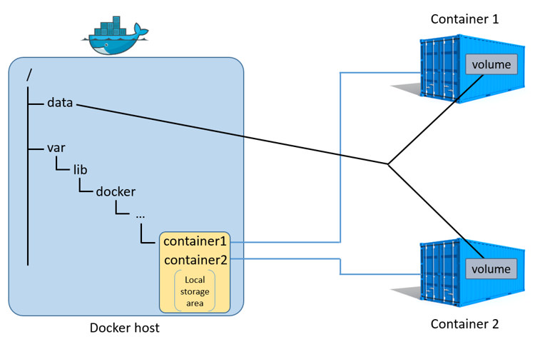

Einleitung
----------

Docker Volumes und Verzeichnis auf dem Host

Quelle: <a href="https://boxboat.com/2016/06/18/docker-data-containers-and-named-volumes//">Docker Data Containers and Named Volumes</a>

- - -

Bis jetzt gingen alle Änderungen im Dateisystem beim Löschen des Docker Containers komplett verloren.

Um Daten Persistent zu halten stellt Docker verschiedene Varianten zur Verfügung

* Ablegen der Daten auf dem Host

* Sharen der Daten zwischen Container

* Eigene, sogenannte Volumes, zum Ablegen von Daten

**Erweiterung Dockerfile**

Um Daten auf dem Host oder in Volumes zu speichern, sind die Verzeichnis mit den Daten via `VOLUME` im Dockerfile einzutragen.

Beispiel MySQL:

	VOLUME /var/lib/mysql
