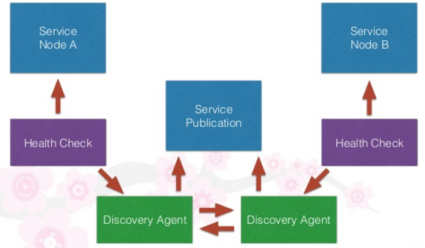

Service Discovery und Load Balancing
------------------------------------

Quelle: <a href="http://www.slideshare.net/lynxmanuk/puppet-camp-london-fall-2015-service-discovery-and-puppet">Service Discovery and Puppet</a>

- - -

Service Discovery ist der Prozess, Clients eines Service mit Verbindungsinformationen (normalerweise IP-Adresse und
Port) einer passenden Instanz davon zu versorgen.

In einem statischen System auf einem Host ist das Problem einfach zu lösen, denn es gibt nur eine Instanz von allem. 

In einem verteilten System mit mehreren Instanzen von Services, die kommen und gehen, ist das aber viel komplizierter. 

Eine Möglichkeit ist, dass der Client einfach den Service über den Namen anfordert (zum Beispiel db oder api) und im Backend dann ein bisschen Magie geschieht, die dazu die passenden Daten liefert. 

Für unsere Zwecke kann Vernetzung als der Prozess des Verknüpfens von Containern betrachtet werden. 

Es geht nicht darum, reale Ethernet-Kabel einzustecken. Containervernetzung beginnt mit der Annahme, dass es eine Route zwischen Hosts
gibt – egal, ob diese Route über das öffentliche Internet läuft oder nur über einen schnellen lokalen Switch.

Mit dem Service Discovery können Clients also Instanzen finden, und die Vernetzung kümmert sich darum, die Verbindungen herzustellen. 

Vernetzungs Service-Discovery-Lösungen haben häufig gemeinsame Funktionalität, da Service-Discovery-Lösungen auf Ziele im Netz verweisen und Vernetzungslösungen häufig auch Service-Discovery-Features enthalten.

Weitere Funktionen von Service Discovery können sein:

* Health Checking
* Failover 
* [Load Balancing](https://de.wikipedia.org/wiki/Lastverteilung_%28Informatik%29)
* Verschlüsselung der übertragenen Daten 
* Isolieren von Containergruppen.

### Lastverteilung (Load Balancing)

Mittels Lastverteilung (englisch Load Balancing) werden in der Informatik umfangreiche Berechnungen oder große Mengen von Anfragen auf mehrere parallel arbeitende Systeme verteilt. 

Insbesondere bei Webservern ist eine Lastverteilung wichtig, da ein einzelner Host nur eine begrenzte Menge an HTTP-Anfragen auf einmal beantworten kann. 

Für unsere Zwecke kann Lastverteilung als der Prozess des Verteilens von Anfragen auf verschiedene Container betrachtet werden.

### Links

* [etcd](https://github.com/coreos/etcd)
* [SkyDNS](https://github.com/skynetservices/skydns)
* [consul](https://www.consul.io/)
* [Service Discovery using etcd, Consul and Kubernetes](http://www.slideshare.net/SreenivasMakam/service-discovery-using-etcd-consul-and-kubernetes)
