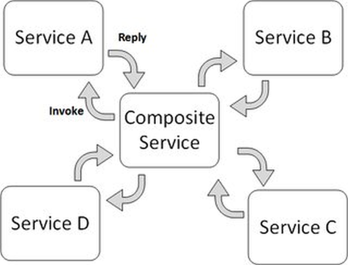

Clustering und Orchestrierung
-----------------------------

Orchestration vs. Choreography

Quelle: <a href="http://stackoverflow.com/questions/4127241/orchestration-vs-choreography">stackoverflow.com</a>

- - -

### Cluster

Ein [Rechnerverbund oder Computercluster](https://de.wikipedia.org/wiki/Rechnerverbund), meist einfach Cluster genannt (vom Englischen für „Rechner-Schwarm“, „-Gruppe“ oder „-Haufen“), bezeichnet eine Anzahl von vernetzten Computern. 

Der Begriff wird zusammenfassend für zwei unterschiedliche Aufgaben verwendet: 
* die Erhöhung der Rechenkapazität (HPC-Cluster) 
* die Erhöhung der Verfügbarkeit (HA-Cluster, engl. high available - hochverfügbar). 

Die in einem Cluster befindlichen Computer (auch Knoten, vom englischen nodes oder Server) werden auch oft als Serverfarm bezeichnet.

### Orchestrierung

[Orchestrierung](https://de.wikipedia.org/wiki/Dienstekomposition#Orchestrierung) (englisch orchestration, Instrumentierung, Inszenierung) ist das flexible Kombinieren mehrerer Services zu einer Komposition. 

Diese Komposition beschreibt einen ausführbaren Dienst (Service). 

Sowohl unternehmensinterne als auch unternehmensexterne Dienste können kombiniert werden. 

Der Prozessfluss wird durch einen Teilnehmer kontrolliert. Jeder Dienst hat dabei einen eingeschränkten Sichtbereich (englisch scope) und kann für Prozesse nur innerhalb seines Sichtbereichs entscheiden. 

### Links

* [Swarm](https://docs.docker.com/engine/swarm/)
* [Orchestration vs. Choreography](http://stackoverflow.com/questions/4127241/orchestration-vs-choreography)