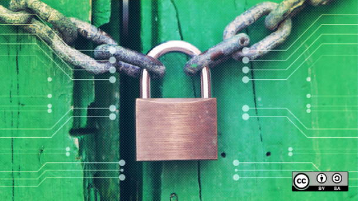

Einleitung
----------

Quelle: Opensource.com

- - -

Um Docker sicher einzusetzen, müssen Ihnen die potenziellen Sicherheitslücken bewusst sein, und Sie sollten die wichtigsten Tools und Techniken kennen, mit
denen Sie containerbasierte Systeme absichern können. 

In diesem Kapitel werden wir uns vor allem mit der Sicherheit beim Ausführen von Docker im Produktivumfeld beschäftigen, die meisten Ratschläge lassen sich aber auch in der Entwicklung anwenden. 

Denn trotz des Themas ist es wichtig, Entwicklungs- und Produktivumgebung gleich zu halten, um sich nicht wieder die Probleme einzufangen,
die beim Transport von Code zwischen den Umgebungen auftreten können und wegen denen man Docker ja gerade einsetzen will. 

### Links

* [Docker Images Insecurity](https://titanous.com/posts/docker-insecurity)
* [Are Docker containers really secure?](https://opensource.com/business/14/7/docker-security-selinux)

Beachten Sie allerdings, dass die in Jonathans Artikel angesprochenen Probleme zum größten Teil durch die Entwicklung von Digests und das Notary-Projekt angegangen wurden.