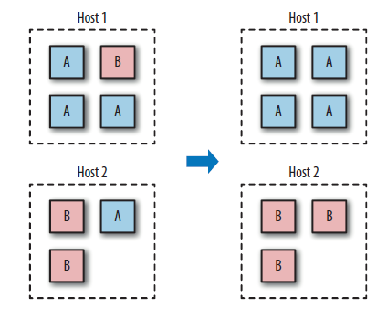

Container nach Host trennen
---------------------------

Container nach Host trennen

Quelle: Docker Adrian Mouat, dpunkt.verlag

- - -

Haben Sie ein Multitenancy-Setup, bei dem Sie Container für mehrere Benutzer laufen lassen (sei es, dass es sich um interne Benutzer in Ihrem Unternehmen oder um externe Kunden handelt), stellen Sie sicher, dass jeder Benutzer auf einem eigenen Docker Host untergebracht ist.

Das ist weniger effizient, als Hosts mit mehreren Benutzern zu teilen, aber sehr wichtig für die Sicherheit. Der Hauptgrund ist, damit Container-Breakouts zu verhindern, bei denen ein Anwender Zugriff auf die Container oder Daten eines anderen Anwenders erhält. 

Geschieht solch ein Breakout, befindet sich der Angreifer immer noch auf einer getrennten VM oder einem eigenen Rechner, so dass er nicht problemlos auf Container anderer Benutzer zugreifen kann.