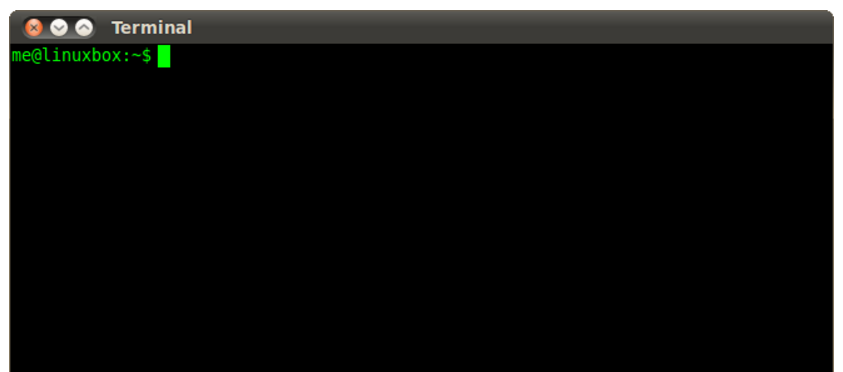

Bash und Git
------------

**[Bash (für Bourne-again shell)](https://de.wikipedia.org/wiki/Bash_(Shell))** ist eine freie Unix-Shell und Teil des GNU-Projekts. Sie ist heute auf vielen unixoiden Systemen die Standard-Shell.

Bash wird Verwendet zur Ausführung von Shellscripts und zum Einloggen (via `ssh`) auf die Virtuellen Maschinen.

**[Git](https://de.wikipedia.org/wiki/Git)** ist eine freie Software zur verteilten Versionsverwaltung von Dateien, die durch Linus Torvalds initiiert wurde.

Git wird Verwendet als Client zu Versionsverwaltungssystemen.

### Installation

Windows: 
* Installation laut [Bash + Git](https://git-scm.com/)

Mac:
* Bash keine Aktionen notwendig.
* Git siehe [Git Buch](https://git-scm.com/book/de/v1/Los-geht%E2%80%99s-Git-installieren#Installation-unter-Mac-OS-X).

Linux
* Bash keine Aktionen notwendig.
* Git siehe [Git Buch](https://git-scm.com/book/de/v1/Los-geht%E2%80%99s-Git-installieren#Installation-unter-Linux).

### Links

* [Bash auf Wikipedia](https://de.wikipedia.org/wiki/Bash_(Shell))
* [Learning the Shell](http://linuxcommand.org/lc3_learning_the_shell.php)
* [Informationen zu einem Befehl](https://wiki.ubuntuusers.de/Howto/Informationen_zu_einem_Befehl/)

	