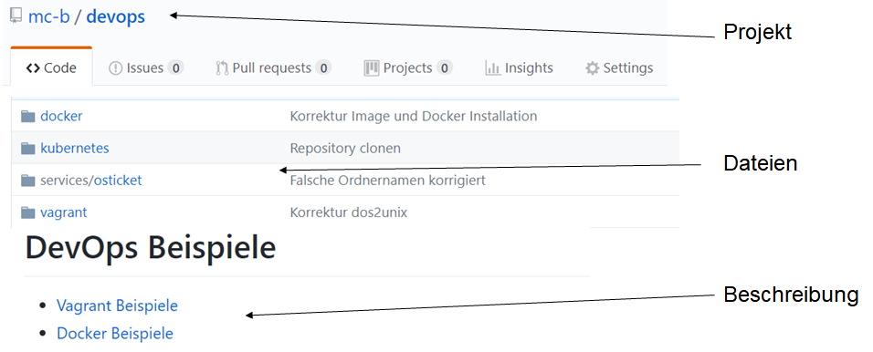

GitHub
------

 

- - -

[GitHub](https://de.wikipedia.org/wiki/GitHub) ist eine Webanwendung zur Versionsverwaltung für Softwareprojekte auf Basis von git. Sie bietet diverse Management und Bug-Tracking-Funktionalitäten.

Die Beispiele befinden sich auf [GitHub](https://de.wikipedia.org/wiki/GitHub) in einem GitHub Project mit dem URL: [https://github.com/mc-b/devops](https://github.com/mc-b/devops).

### Repository von GitHub Project clonen

Starten Sie `Bash`, setzen Mail und Username und clonen das Repository mit den Beispielen:

    git config --global user.name "<username>"
    git config --global user.email "<mail>"
    git clone https://github.com/mc-b/devops
    cd devops

Alternative: Drücken Sie auf den Download-Button und laden die Beispiele als ZIP-Datei herunter.

### Testen

Starten Sie `Bash`, wechseln in das Verzeichnis `devops` und führen folgende Befehle aus:

	git pull
	git status
	
Die Befehle sollten Ihnen anzeigen, dass alles auf dem aktuellen Stand ist.

### Links

* [Git Buch](https://git-scm.com/book/de/v1) 
* [Online Training](https://try.github.io/levels/1/challenges/1)