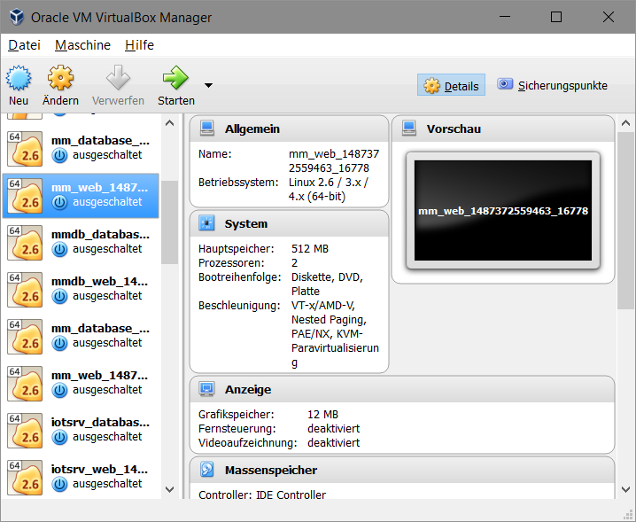

VirtualBox
----------

[VirtualBox](https://de.wikipedia.org/wiki/VirtualBox) ist eine Virtualisierungssoftware und erlaubt es, lokal auf dem PC sogenannte Virtuelle Maschinen zu Erstellen und zu Verwalten.

VirtualBox wird verwendet weil das Zusammenspiel mit `vagrant` am Besten funktioniert und die Software frei Verfügbar ist (Open Sourcen).

### Installation

Windows / Mac:
* VirtualBox ab [Webseite](https://www.virtualbox.org/) - oder **wenn ein interner Server vorhanden ist** ab [{{config.server}}/download]({{config.server}}/download) Installieren.

Linux:
* VirtualBox via `apt-get` Installieren

	sudo apt-get install -y virtualbox virtualbox-qt virtualbox-dkms 

### Testen

* [Ubuntu Desktop](https://www.ubuntu.com/download/desktop) Image herunterladen - **wenn ein interner Server vorhanden ist**: [{{config.server}}/cd-mirror]({{config.server}}/cd-mirror) verwenden.
  
* Erstellen einer VirtualBox VM mit Linux und dem heruntergeladenen Image als CD Laufwerk.

* Booten der VM und Installieren der Linux Desktop Umgebung.
 
* Im Menu das [Software Controlcenter](https://wiki.ubuntuusers.de/Synaptic/) ö.ä. suchen und starten.

* Im  [Software Controlcenter](https://wiki.ubuntuusers.de/Synaptic/) nach apache suchen und diesen installieren.

* Testen mittels Starten des Browsers und Angabe von [http://localhost](http://localhost).

**Hinweis**

Alternativ zum VirtualBox UI existiert ein Kommandozeilenprogramm `VBoxManage` welches Informationen über die VMs liefert.

Anzeige aller Erstellten VM in VirtualBox:

	VBoxManage list vms

Liste der aktiven VMS

	VBoxManage list runningvms
	
Liste der Host only Netzwerkadapter

	VBoxManage list hostonlyifs

### Links

* [VirtualBox Website](https://www.virtualbox.org/)