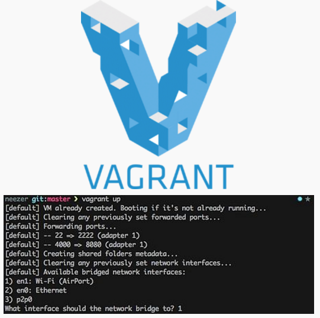

Vagrant
-------

[Vagrant](https://de.wikipedia.org/wiki/Vagrant_(Software)) ist eine Open-Source Ruby-Anwendung zum Erstellen und Verwalten von virtuellen Maschinen, mittels sogenannten `Vagrantfiles`.

### Installation

Windows / Mac / Linux:
* Vagrant ab [Webseite](https://www.vagrantup.com/downloads.html) - oder **wenn ein interner Server vorhanden ist**: ab [{{config.server}}/cd-mirror]({{config.server}}/cd-mirror) Installieren

### Testen

Bash starten, neues Verzeichnis erstellen, `Vagrantfile` erzeugen und Virtuelle Maschine (VM) erstellen und starten:

	mkdir ubuntu
	cd ubuntu
	vagrant init ubuntu/xenial64
	vagrant up --provider virtualbox
	
Oder - **wenn ein interner Server vorhanden ist**:	

	vagrant box add http://10.1.66.11/vagrant/ubuntu/xenial64.box --name ubuntu/xenial64
	vagrant init ubuntu/xenial64
	vagrant up --provider virtualbox
	
In die VM wechseln und einige Linux Befehle (Verzeichnis anzeigen, Freier Speicherplatz und Memory) absetzen

	vagrant ssh
	ls -l /bin
	df -h
	free -m
	
Die VM kann über die VirtualBox Oberfläche ausgeschaltet werden.

### Apache Web Server automatisiert aufsetzen

Bash starten, ins Verzeichnis `devops/vagrant/web` wechseln und folgende Befehle eingeben:

	cd devops/vagrant/web
	vagrant up
	
Apache Web Server Hauptseite mittels [http://localhost:8080](http://localhost:8080) aufrufen.

Hauptseite `index.html` im Verzeichnis `devops/vagrant/web` editieren und Resulat im Browser überprüfen.

**Anmerkung:** falls der Port 8080 bereits belegt ist, wird automatisch ein anderer Port gewählt. Ausgabe von `vagrant up` beachten.

Am Schluss kann die VM wie folgt gelöscht werden:

	vagrant destroy -f

### Links

* [Vagrant Website](https://www.vagrantup.com/)
* [Vagrant Boxen](https://atlas.hashicorp.com/boxes/search)

### FAQ

**Vagrant kann unter Windows 10 keine VM erzeugen, weil Hyper-V aktiv ist**
* **Lösung:** Hyper-V wie in [Hyper-V unter Windows 10 aktivieren und deaktivieren](https://www.xcep.net/blog/hyper-v-unter-windows-10-aktivieren-und-deaktivieren/) beschrieben, deaktiveren. 

**Vagrant up finishes but VM's not showing up in VirtualBox**
* Das vagrant/mmdb Beispiel kann keinen Netzwerkadapter anlegen.
* **Lösung:** Netzwerk manuell unter Datei -> Einstellungen -> Netzwerk -> Host-only Netzwerke mit IPv4 Adresse 192.168.55.1 und Netzmaske 255.255.255.0 anlegen.

**VirtualBox und vagrant nicht mehr Synchron.**
* **Lösung:** VM in VirtualBox manuell löschen und im Beispielverzeichnis (wo Vagrantfile steht) das Verzeichnis .vagrant weglöschen.

**Vagrant kann keine ssh Verbindung zur VM aufbauen.**
* **Lösung:** Firewall deaktivieren.

**vagrant up kann keine Host Ordner mehr mounten.**
* **Lösung:** Installieren Sie VirtualBox in der Version 5.2.6 ab Download

**Vagrant und VirtualBox Produzieren nicht nachvollziehbare Fehler.**
* **Lösung:** Beispiele in ein Verzeichnis ohne " " Leerschlag clonen/downloaden.

**vagrant wird in der Bash nicht gefunden.**
* **Lösung:** Verzeichnis wo sich vagrant.exe befindet in PATH eintragen.

**Alle anderen Fehler.**
* **Lösung:** Vagrant mittels `vagrant up --debug` starten.

