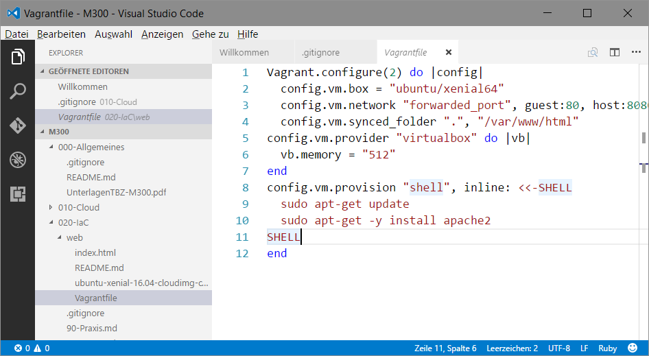

Visual Studio Code
------------------

[Visual Studio Code](https://en.wikipedia.org/wiki/Visual_Studio_Code) ist ein Source Code Editor. Entwickelt von Microsoft for Windows, Linux and macOS. 

[Visual Studio Code](https://en.wikipedia.org/wiki/Visual_Studio_Code) bietet u.a. Integrierten Support für `Git` und Syntax Coloring für `Markdown` und `Vagrantfiles`.

### Installation

Windows / Mac / Linux:
* Visual Studio Code ab [Webseite](https://code.visualstudio.com/) Installieren.

### Feintuning

Für Syntax Coloring von Vagrantfiles und Anzeige von PDF Dateien folgende Extension (Ctrl+Shift+X und dann Suchen) Installieren:
* Vagrant Extension von Marco Stanzi
* vscode-pdf Extension von tomiko1207

`Datei -> Einstellungen -> Einstellungen` öffnen und im Editor rechts folgende Einstellungen ergänzen:

	// Der Pfad zur ausführbaren Git-Datei.
    "git.path": "C:\\Program Files\\Git\\bin\\git.exe",
	    
    // Passt an, welches Terminal für Windows ausgeführt werden soll.
    "terminal.external.windowsExec": "C:\\Program Files\\Git\\git-bash.exe",
	
    // Der Pfad der Shell, den das Terminal unter Windows verwendet. 
    "terminal.integrated.shell.windows": "C:\\Program Files\\Git\\git-bash.exe",
	
    // Konfiguriert die Globmuster zum Ausschließen von Dateien und Ordnern.
    "files.exclude": {
      "**/.git": true,
      "**/.svn": true,
      "**/.hg": true,
      "**/.vagrant": true,
      "**/.DS_Store": true
    },
 
Die Pfade sind Entsprechend der Installationsverzeichnisse und Betriebssystem anzupassen. 

Bei Linux und Mac kann auf alle bis auf den letzten Eintrag verzichtet werden.

### Testen

Mittels `Datei -> Ordner öffnen` den Ordner (z.B. C:\TBZ\devops) mit den Arbeitsunterlagen öffnen.

Rechts in Ordnerstruktur z.B. nach `vagrant/web` und mittels rechter Maustaste -> `In Eingabeaufforderung öffnen`, Bash starten.

Ebenfalls mittels der rechten Maustaste können die PDF Dateien im Editor angezeigt werden

Eine `Markdown` Vorschau (im HTML Format) erhält man mittels `Ctrl+Shift+V`.

### Links

* [Hauptseite](https://code.visualstudio.com/)
* [GitHub Projektseite](https://github.com/Microsoft/vscode)

