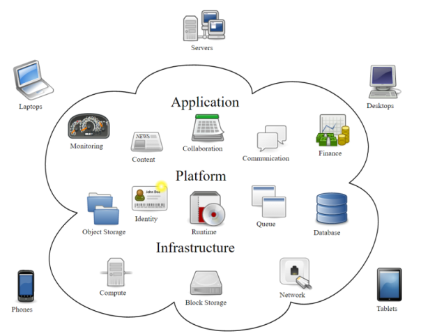

Cloud Computing
---------------

Quelle: Wikipedia

- - -

Unter [Cloud Computing](https://de.wikipedia.org/wiki/Cloud_Computing) (deutsch Rechnerwolke) versteht man die Ausführung von Programmen, die nicht auf dem lokalen Rechner installiert sind, sondern auf einem anderen Rechner, der aus der Ferne aufgerufen wird (bspw. über das Internet).

Technischer formuliert umschreibt das Cloud Computing den Ansatz, IT-Infrastrukturen (z. B. Rechenkapazität, Datenspeicher, Datensicherheit, Netzkapazitäten oder auch fertige Software) über ein Netz zur Verfügung zu stellen, ohne dass diese auf dem lokalen Rechner installiert sein müssen.

Angebot und Nutzung dieser Dienstleistungen erfolgen dabei ausschliesslich über technische Schnittstellen und Protokolle sowie über Browser. Die Spannweite der im Rahmen des Cloud Computings angebotenen Dienstleistungen umfasst das gesamte Spektrum der Informationstechnik und beinhaltet unter anderem Infrastruktur (z. B. Rechenleistung, Speicherplatz), Plattformen und Software.

### Technische Realisierungen von Cloud Computing

**Infrastruktur (Infrastructure as a Service - IaaS)**

Die Infrastruktur oder „Cloud Foundation“ stellt die unterste Schicht im Cloud Computing dar. Der Benutzer greift hier auf bestehende Dienste innerhalb des Systems zu, verwaltet seine Recheninstanzen (virtuelle Maschinen) allerdings weitestgehend selbst. 

**Plattform (Platform as a Service - PaaS)**

Der Entwickler erstellt die Anwendung und lädt diese in die Cloud. Diese kümmert sich dann selbst um die Aufteilung auf die eigentlichen Verarbeitungseinheiten. Im Unterschied zu IaaS hat der Benutzer hier keinen direkten Zugriff auf die Recheninstanzen. Er betreibt auch keine virtuellen Server.

**Anwendung (Software as a Service - SaaS)**

Die Anwendungssicht stellt die abstrakteste Sicht auf Cloud-Dienste dar. Hierbei bringt der Benutzer seine Applikation weder in die Cloud ein, noch muss er sich um Skalierbarkeit oder Datenhaltung kümmern. Er nutzt eine bestehende Applikation, die ihm die Cloud nach aussen hin anbietet.

