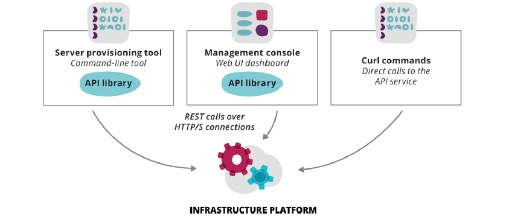

Dynamic Infrastructure Platforms - Anforderungen
------------------------------------------------

Quelle: Infrastructure as Code, By Kief Morris, Publisher: O'Reilly Media

- - -

Damit "Infrastructure as Code" auf "Dynamic Infrastructure Platforms" genutzt werden können, müssen sie die folgenden Anforderungen erfüllen:

- **Programmierbar** - Ein Userinterface ist zwar angenehm und viele Cloud Anbieter haben eines, aber für "Infrastructure as Code"
muss die Plattform via Programmierschnittstelle ([API](https://de.wikipedia.org/wiki/Programmierschnittstelle)) ansprechbar sein.
- **On-demand** - Ressourcen (Server, Speicher, Netzwerke) schnell erstellen und vernichtet.
- **Self-Service** - Ressourcen anpassen und auf eigene Bedürfnisse zuschneiden.
- **Portabel** - Anbieter von Ressourcen müssen austauschbar sein.
- Sicherheit, Zertifizierungen (z.B. [ISO 27001](https://de.wikipedia.org/wiki/ISO/IEC_27001)), ...
