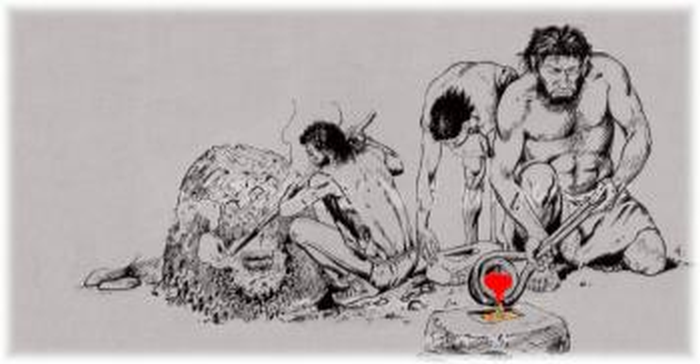

"Eisenzeit" vs Cloud Zeitalter 
------------------------------

Quelle: www.gauting.de

- - -

### Eisenzeit

In der "Eisenzeit", der IT, waren die IT Systeme an physikalische Hardware gebunden. 

Die Bereitstellung und Aufrechterhaltung der Infrastruktur war manuelle Arbeit. 

Es wurde viel Arbeitszeit investiert die Systeme bereitzustellen und am Laufen zu halten. 

Änderungen waren teuer.

### Cloud Zeitalter

Im Cloud Zeitalter, der IT, sind Systeme von der physikalischen Hardware entkoppelt, sie sind **Virtualisiert**.

Bereitstellung und Wartung können an Software-Systeme delegiert werden und befreien
die Menschen von Routinearbeiten.

Änderungen können in Minuten, wenn nicht in Sekunden vorgenommen werden. 

Das Management kann diese Geschwindigkeit, für einen schnelleren Marktzugang ausnutzen

Quelle: Infrastructure as Code, By Kief Morris, Publisher: O'Reilly Media

