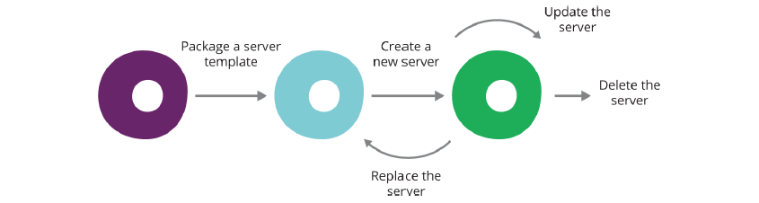

Tools
-----

Quelle: Infrastructure as Code, By Kief Morris, Publisher: O'Reilly Media

- - - 

Folgende Arten von Tools werden für "Infrastructure as Code" benötigt:

- **Infrastructure Definition Tools** - Tools zur Bereitstellung und Konfiguration einer Sammlung von Ressourcen, z.B. [OpenStack](https://www.openstack.org/), [TerraForm](https://www.terraform.io/), [CloudFormation](https://aws.amazon.com/de/cloudformation/)
- **Server Configuration Tools** - Tools zur Bereitstellung und Konfiguration von Servern (Virtuellen Maschinen), z.B. [vagrant](https://www.vagrantup.com/), [packer](https://www.packer.io/), [docker](https://www.docker.com/)
- **Package Management Tools** - Tools zur Bereitstellung und Verteilung von vorkonfigierter Software, vergleichbar mit einem APP-Store. Linux: [APT](https://www.debian.org/doc/manuals/debian-faq/ch-pkgtools.en.html), [YUM](https://de.wikipedia.org/wiki/Yellowdog_Updater,_Modified), Windows: [WiX](http://wixtoolset.org/), Plattformneutral: [SBT native packager ](https://github.com/sbt/sbt-native-packager)
- **Scripting** - [Kommandozeileninterpreter](https://de.wikipedia.org/wiki/Kommandozeileninterpreter) kurz: CLI (engl. command-line interpreter oder command-line shell) zur Schrittweisen Abarbeitung von Befehlen. Linux, Mac, Windows 10: [Bash](https://de.wikipedia.org/wiki/Bash_(Shell), Windows: [PowerShell](https://de.wikipedia.org/wiki/PowerShell)
- **Versionsverwaltung und Hubs** - zur Versionskontrolle der Definitionsdateien und als Ablage vorbereiteter Images. [GitHub](https://github.com/mc-b/IoTKit/tree/master/docker), [Vagrant Boxes](https://atlas.hashicorp.com/boxes/search), [Docker Hub](https://hub.docker.com/), [Windows VM](https://developer.microsoft.com/en-us/microsoft-edge/tools/vms/)
