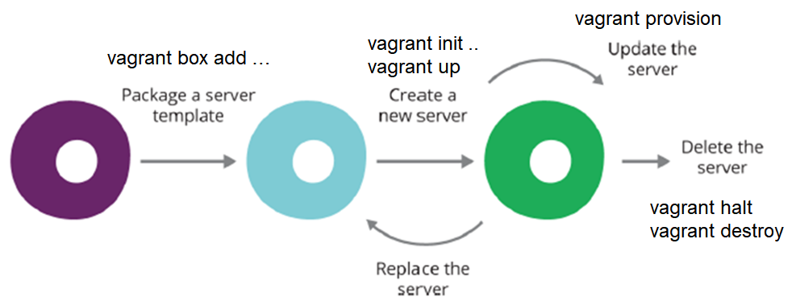

Vagrant Workflow
----------------

Quelle: Infrastructure as Code, By Kief Morris, Publisher: O'Reilly Media

- - -

### Package a server template

Hinzufügen einer Box zur lokalen Registry :

	vagrant box add <box> [--name <name>]
	
Box holen von [Atlas Vagrant Boxes](https://atlas.hashicorp.com/boxes/search) oder von lokalen Web Server
	
	vagrant box add ubuntu/xenial64
	
oder 

	vagrant box add {{config.server}}/vagrant/ubuntu/xenial64.box --name ubuntu/xenial64
	
Eigene Boxen, in der Registry, anzeigen

	vagrant box list
	
### Create a new server

	vagrant init <box>
	vagrant up

`Vagrantfile` Erzeugen und Provisionierung starten:

	mkdir myserver
	cd myserver
	vagrant init ubuntu/xenial64
	vagrant up

Aktueller Status des Servers

	vagrant status

### Update the server

Nach Änderungen im `Vagrantfile` kann ein Server wie folgt aktualisiert werden:

	vagrant provision 
	
oder 

	vagrant destroy -f
	vagrant up
	
### Delete the server

	vagrant destroy -f
	
### Replace the server

Neuer Server erstellen bzw. dessen `Vagrantfile` und Testen.

Evtl. Daten migrieren. Nur nötig wenn die Daten nicht auf Host abgelegt sind oder bei einer neuen Datenbank Version

Neuer Server in Betrieb nehmen.

	vagrant init
	vagrant up

DNS Umhängen

Alten Server herunterfahren

	vagrant halt

Alten Server zerstören

	vagrant destroy -f
	