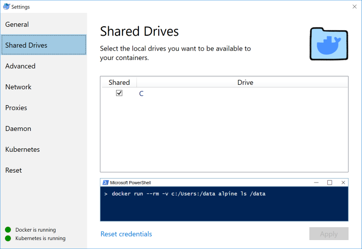
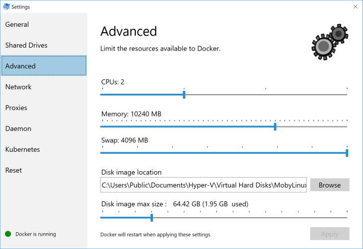
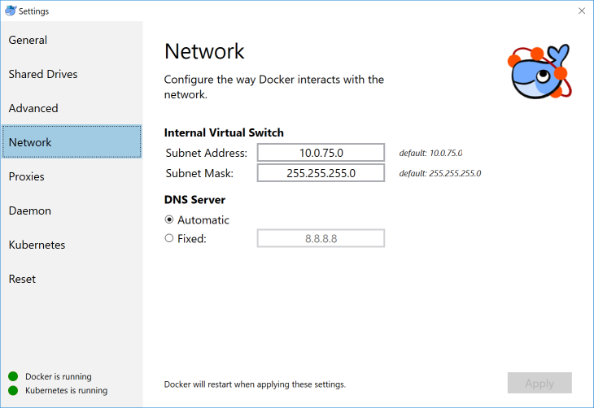
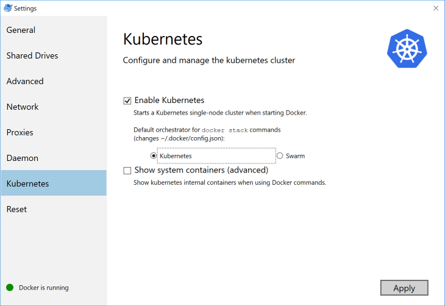

Docker for Windows / Mac
------------------------

### Feintuning

**Shared Drives** aktivieren, Verzeichnis `C:/Users/data` Erstellen und Persistent Volume und Claim in Kubernetes erstellen.

Dem Verzeichnis `C:/Users/data` ist Vollzugriff für `Jeder` freizuschalten.

	kubectl create -f docker4windows/DataVolume.yaml

	
	
Die Pods speichern alle Daten im Verzeichnis `C:/Users/data`. Sollen die Daten woanders gespeichert werden ist der Eintrag `hostPath`in `DataVolume.yaml` anzupassen.

**Memory**, je nach Einsatz anpassen.
* Gogs, Kanboard, Jupyter etc. sollten 4096 MB reichen
* Microservices einen Wert grösser 8192 MB einstellen. 

**Netzwerk**

Netzwerk Subnet Address (LoadBalancer = .1) notieren. Diese wird für Services gebraucht, die auf den LoadBalancer zusteuern.

**Kubernetes** aktivieren

### Dashboard aktivieren (optional)

    kubectl apply -f https://raw.githubusercontent.com/kubernetes/dashboard/master/src/deploy/recommended/kubernetes-dashboard.yaml

Weitere Informationen:
* [github Projekt](https://github.com/kubernetes/dashboard)

### Weave Scope aktivieren (optional)

* [Kubernetes Add-ons](../addons)

### Ingress (Reverse Proxy) aktivieren (optional)

