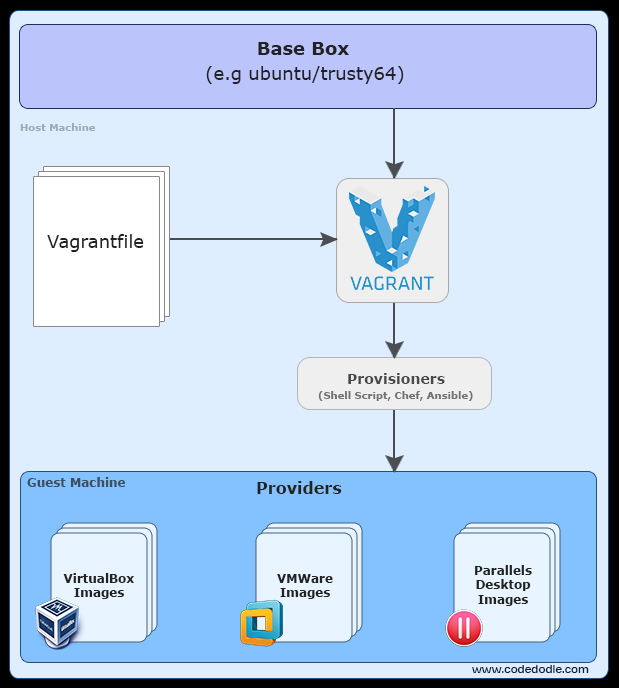

Funktionsweise und Konzepte
---------------------------

Vagrant Funktionsweise

Quelle: <a href="http://www.codedodle.com/2016/01/vagrant-getting-started-create-and.html">CodeDodle</a>

- - -

### Kommandline-Interface (CLI)

Vagrant wird über die Kommandozeile [(CLI)](https://de.wikipedia.org/wiki/Kommandozeile) bedient.

Die wichtigsten Befehle sind:

- [vagrant init](https://www.vagrantup.com/docs/cli/init.html) - Initialisiert im aktuellen Verzeichnis eine Vagrant Umgebung und erstellt, falls nicht vorhanden, ein Vagrantfile.
- [vagrant up](https://www.vagrantup.com/docs/cli/up.html) - Erzeugt und Konfiguriert eine neue Virtuelle Maschine, basierend auf Vagrantfile.
- [vagrant ssh](https://www.vagrantup.com/docs/cli/ssh.html) - Wechselt von lokalen CLI in die CLI Umgebung (Bash) der Virtuellen Maschine mittels [SSH](https://de.wikipedia.org/wiki/Secure_Shell)
- [vagrant status](https://www.vagrantup.com/docs/cli/status.html) - Zeigt den aktuellen Status der VM an
- [vagrant port](https://www.vagrantup.com/docs/cli/port.html) - Zeigt die Weitergeleiteten Ports der VM an
- [vagrant halt](https://www.vagrantup.com/docs/cli/halt.html) - Stoppt die laufende Virtuelle Maschine
- [vagrant destroy](https://www.vagrantup.com/docs/cli/destroy.html) - Stoppt die Virtuelle Maschine und zerstört sie.
- [Weitere Befehle](https://www.vagrantup.com/docs/cli/), vagrant reload, vagrant global-status ...

### Boxen

Boxen sind bei Vagrant vorkonfigurierte (Vorlagen) Virtuelle Maschinen. Dies soll den Prozess der Softwareverteilung und der Entwicklung beschleunigen. Jede Box, die von dem Nutzer benutzt wurde, wird auf dem Computer gespeichert und muss so nicht wieder aus dem Internet geladen werden.

Boxen können explizit durch den Befehl `vagrant box add [box-name]` oder `vagrant box add [box-url]` heruntergeladen und durch `vagrant box remove [box-name]` entfernt werden. Ein „box-name“ ist dabei durch Konvention wie folgt aufgebaut: **Entwickler/Box**, zum Beispiel **ubuntu/xenial64**. 

[Vagrant Box](https://atlas.hashicorp.com/boxes/search) dient dabei als Austauschplattform für die Suche nach Boxen und das Einstellen von eigenen Boxen. Wird nur ein box-name angegeben wird davon ausgegangen, dass die box lokal vorhanden ist und ansonsten wird in der Vagrant Cloud nach der Box gesucht.

### Konfiguration

Die gesamte Konfiguration erfolgt im Vagrantfile. Die Syntax ist dabei an die Programmiersprache [Ruby](https://de.wikipedia.org/wiki/Ruby_(Programmiersprache)) angelehnt.

	Vagrant.configure(2) do |config|
	  config.vm.box = "ubuntu/xenial64"
	end

### Provisioning

Provisioning bedeutet bei Vagrant die Anweisung an ein anderes Programm. In den meisten Fällen an eine Shell, wie [Bash](https://de.wikipedia.org/wiki/Bash_(Shell). Die nachfolgenden Zeile installieren den Web Server Apache.

    config.vm.provision "shell", inline: <<-SHELL 
      sudo apt-get update
      sudo apt-get -y install apache2
    SHELL

### Provider 

[Provider](https://de.wikipedia.org/wiki/Provider) bedeutet bei Vagrant welche Dynamic Infrastructure Platform / Virtualisierte Umgebung zum Einsatz kommt.

    config.vm.provider "virtualbox" do |vb|
      vb.memory = "512"  
    end

### Links zu Providern und weiteren Infos

- [Virtualbox](https://de.wikipedia.org/wiki/VirtualBox) - `vagrant init hashicorp/precise64; vagrant up --provider virtualbox`
- [Hyper-V](https://de.wikipedia.org/wiki/Hyper-V) - `vagrant init hashicorp/precise64; vagrant up --provider hyperv`
- [VMWare Fusion](https://de.wikipedia.org/wiki/VMware#VMware_Fusion) - `vagrant init hashicorp/precise64; vagrant up --provider vmware_fusion`
- [Amazon Cloud](https://de.wikipedia.org/wiki/Amazon_Web_Services) - `vagrant up --provider=aws`
- [Microsoft Azure](https://github.com/Azure/vagrant-azure)
- [Google Cloud](https://github.com/mitchellh/vagrant-google)
- [VMWare vSphere](https://github.com/nsidc/vagrant-vsphere)
* [IBM Bluemix Vagrant Diskussion](https://developer.ibm.com/answers/questions/10957/vagrant-support.html)

* [Schweizer Anbieter](https://www.exoscale.ch/syslog/2013/12/18/exoscale-vagrant/)

* [Vagrantfile Beispiele](https://github.com/lowescott/learning-tools) 

 

