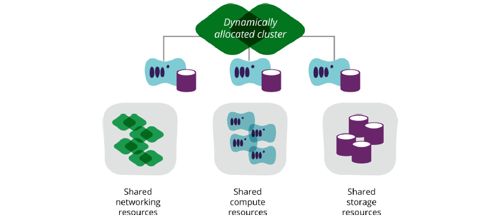

Gemeinsame Ordner (Synced Folders)
---------------------------------

Quelle: Infrastructure as Code, By Kief Morris, Publisher: O'Reilly Media

- - - 

Synchronisierte Ordner ermöglichen es der Virtuellen Maschine auf Ordner des Host Computers zuzugreifen.

	Vagrant.configure(2) do |config|
	  config.vm.synced_folder ".", "/var/www/html"  
	end

**Standardmässig wird das aktuelle Vagrant Verzeichnis in der Virtuellen Maschine unter /vagrant gemountet.**

Weitere Informationen: [Vagrant Synced folders](https://www.vagrantup.com/docs/synced-folders/)
	