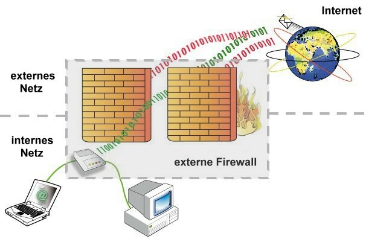

Einleitung 
----------

Bis jetzt sind alle Services ungehindert Zugriffbar. Würden wir den Raspberry Pi direkt in das Internet oder eine DMZ stellen hätten wir ein grösseres Sicherheitsproblem. Um das zu verhindern sperren wir nicht öffentliche Ports mittels einer Firewall und verschlüsseln den restlichen Datenverkehr mittels eines Reverse Proxies.

### Firewall {#firewall}

Eine [Firewall](http://de.wikipedia.org/wiki/Firewall) (von englisch firewall ‚Brandwand‘ oder ‚Brandmauer‘) ist ein Sicherungssystem, das ein Rechnernetz oder einen einzelnen Computer vor unerwünschten Netzwerkzugriffen schützt und ist weiter gefasst auch ein Teilaspekt eines Sicherheitskonzepts.

Jedes Firewall-Sicherungssystem basiert auf einer Softwarekomponente. Die Firewall-Software dient dazu, den Netzwerkzugriff zu beschränken, basierend auf Absender- oder Zieladresse und genutzten Diensten. Sie überwacht den durch die Firewall laufenden Datenverkehr und entscheidet anhand festgelegter Regeln, ob bestimmte Netzwerkpakete durchgelassen werden oder nicht. Auf diese Weise versucht sie, unerlaubte Netzwerkzugriffe zu unterbinden.

### Reverse Proxy

Der [Reverse Proxy](http://de.wikipedia.org/wiki/Reverse_Proxy) ist ein Proxy, der Ressourcen für einen Client von einem oder mehreren Servern holt. Die Adressumsetzung wird in der entgegengesetzten Richtung vorgenommen, wodurch die wahre Adresse des Zielsystems dem Client verborgen bleibt. Während ein typischer Proxy dafür verwendet werden kann, mehreren Clients eines internen (privaten – in sich geschlossenen) Netzes den Zugriff auf ein externes Netz zu gewähren, funktioniert ein Reverse Proxy genau andersherum.