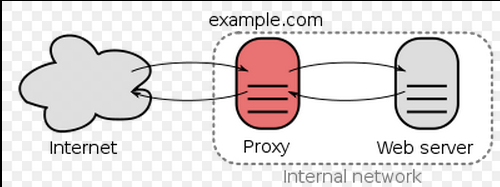

Reverse Proxy
-------------

- - -

Der [Reverse Proxy](http://de.wikipedia.org/wiki/Reverse_Proxy) ist ein Proxy, der Ressourcen für einen Client von einem oder mehreren Servern holt. Die Adressumsetzung wird in der entgegengesetzten Richtung vorgenommen, wodurch die wahre Adresse des Zielsystems dem Client verborgen bleibt. Während ein typischer Proxy dafür verwendet werden kann, mehreren Clients eines internen (privaten – in sich geschlossenen) Netzes den Zugriff auf ein externes Netz zu gewähren, funktioniert ein Reverse Proxy genau andersherum.

Der Apache Server kann auch als Reverse Proxy eingerichtet werden. 

### Beispiele: {#beispiele}

Der Server (VM) `master` unter http://web/master und vom lokalen Host als http://localhost:8080/master zur Verfügung stellen: 

	ProxyPass /master http://master
	ProxyPassReverse /master http://master
	
Ausprobieren im Browser:

	http://localhost:8080/master/cgi-bin/rest
	http://localhost:8080/cgi-bin/rest
	http://localhost:8080/master/cgi-bin/network
	http://localhost:8080/master/phpldapadmin/

### Installation {#installation}

Dazu müssen folgende Module installiert werden:

	sudo apt-get install libapache2-mod-proxy-html
	sudo apt-get install libxml2-dev

Anschliessen die Module aktivieren

	sudo a2enmod proxy
	sudo a2enmod proxy_html
	sudo a2enmod proxy_http 

Die Datei /etc/apache2/apache2.conf wie folgt ergänzen:

	ServerName localhost

Apache Server neu starten

	service apache2 restart

### Konfiguration {#konfiguration}

Die Weiterleitungen sind z.B. in `sites-enabled/001-reverseproxy.conf` eingetragen:

	# Allgemeine Proxy Einstellungen
	ProxyRequests Off
	<Proxy *>
	      Order deny,allow
	      Allow from all
	</Proxy>
	
	# Weiterleitungen master
	ProxyPass /master http://master
	ProxyPassReverse /master http://master

### Links {#links}

*   [Running a Reverse Proxy in Apache](http://www.apachetutor.org/admin/reverseproxies)
*   [Reverse Proxy HU Berlin](http://sarwiki.informatik.hu-berlin.de/Reverse_Proxy)