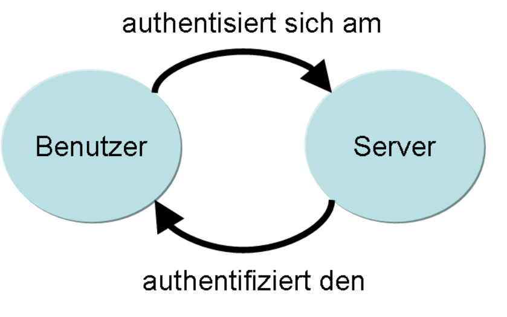

Authentifizierung
-----------------

Quelle: Wikipedia

- - -

[Authentifizierung](https://de.wikipedia.org/wiki/Authentifizierung) (griechisch αυθεντικός authentikós ‚echt‘, ‚Anführer‘; Stammform verbunden mit lateinisch facere ‚machen‘) ist der Nachweis (Verifizierung) einer behaupteten Eigenschaft einer Entität, die beispielsweise ein Mensch, ein Gerät, ein Dokument oder eine Information sein kann, und die dabei durch ihren Beitrag ihre Authentisierung durchführt.

Das zugehörige Verb lautet authentifizieren (englisch: authenticate), das für das Bezeugen der Echtheit von etwas steht.[1] In der Informatik wird das substantivierte Wort Authentifizieren häufig sowohl für den Vorgang der Berechtigungssprüfung als auch für das Ergebnis dieser Überprüfung verwendet, da im englischen Sprachraum zwischen den Aktionen der beteiligten Entitäten syntaktisch nicht unterschieden wird. Im deutschen Sprachraum wird der Begriff Authentifikation[1] für die Prüfung der Echtheit und der Begriff Authentifizierung[1] für die Bezeugung der Echtheit verwendet.

Die Authentisierung einer Entität bezüglich der behaupteten Eigenschaft der Authentizität, die beispielsweise Einräumen einer „bestehenden Zugangsberechtigung“ oder „Echtheit“ sein kann, erlaubt der authentifizierten Entität weitere Aktionen. Die Entität gilt dann als authentisch.

Die eine Authentifizierung abschließende Bestätigung wird auch als Autorisierung bezeichnet, wenn sie durch bestimmte zulässige Modi und/oder in einem bestimmten Kontext eingeschränkt wird. 

### Autorisierung

[Autorisierung](https://de.wikipedia.org/wiki/Autorisierung) ist im weitesten Sinne eine Zustimmung, spezieller die Einräumung von Rechten gegenüber Interessenten, ggf. zur Nutzung gegenüber Dritten. Die Autorisierung überwindet Mechanismen von Sicherungen gegen Unbefugte. Eine Autorisierung hebt keinen Schutz auf. Eine Autorisierung gilt gegebenenfalls eingeschränkt nur in einem Kontext und/oder Modus. Die Autorisierung erfolgt sinnvollerweise nicht ohne eine vorherige erfolgreiche Authentifizierung.

In der Informationstechnologie bezeichnet die Autorisierung das initiale Zuweisen und das wiederholt einleitende Überprüfen von Zugriffsrechten mittels spezieller Methoden bezüglich interessierter Systemnutzer zu Daten und zu Diensten.

Die zwei häufigsten Spezialfälle sind:
* der erlaubte Zugriff auf sogenannte Ressourcen (z. B. auf Verzeichnisse oder Dateien) in einem Computernetzwerk.
* die Erlaubnis zur Installation oder Benutzung von Computerprogrammen (Software).