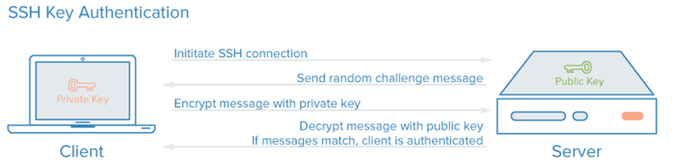

Einleitung
----------

Laptop-Verbindung zu einem Server.

Quelle: How To Configure SSH Key-Based Authentication on a Linux Server

- - -

Es gab einmal eine Zeit, als Computer im Netz über das [Telnet](https://de.wikipedia.org/wiki/Telnet)-Protokoll zugänglich waren. Da dieses Protokoll keine Verschlüsselung bot, wurde das Mitschneiden von Passwörtern zur trivialen Angelegenheit.

Um den Fernzugang zu sichern, schrieb Tatu Ylönen Mitte der 1990er eine Programmsuite – bestehend aus Server, Client und Hilfsprogrammen – die er ssh (secure shell) nannte.

Später gründete er die Firma ssh.com und bot die Version 2 der SSH-Suite nur noch kommerziell an. Daraufhin wurde von Entwicklern des Betriebssystems OpenBSD der öffentliche Quellcode der Version 1 geforkt. Sie entwickelten das Programm unter dem Namen "OpenSSH" weiter. Diese OpenSSH-Suite wurde fester Bestandteil quasi aller Linux-Distributionen.

Drei wichtige Eigenschaften führten zum Erfolg von ssh :
* Authentifizierung der Gegenstelle, kein Ansprechen falscher Ziele
* Verschlüsselung der Datenübertragung, kein Mithören durch Unbefugte
* Datenintegrität, keine Manipulation der übertragenen Daten

### Befehle

Entferntes System aufrufen

	ssh web01
	
	ssh ubuntu@web01
	
Befehl auf entfernten System ausführen

	ssh web01 ls -l
	
Kann auch verwendet werden für eine Sicherung

	ssh root@server 'cd /etc; tar czvf - network/' | cat > etc_network_backup.tar.gz 

Kopieren von Daten von einem System zu einem anderen.

	scp <datei> <server>:<datei>  
	scp <server>:<datei> <datei>
	
**Weitere Befehle/Funktionen sind**

* **[sftp](https://wiki.ubuntuusers.de/SSH/)** - File Transfer (verschlüsselt)
* **[sshfs](https://wiki.ubuntuusers.de/FUSE/sshfs/)** - Entfernte Dateisysteme einbinden

### Links

* [Ubuntu Wiki](https://wiki.ubuntuusers.de/SSH/)
* [PuTTY](https://wiki.ubuntuusers.de/PuTTY/) - Benutzeroberfläche für die Verbindungsverwaltung, läuft auch auf Windows
* [WinSCP](https://winscp.net/eng/docs/lang:de) - WinSCP ist ein grafischer Open Source SFTP und FTP Client für Windows

