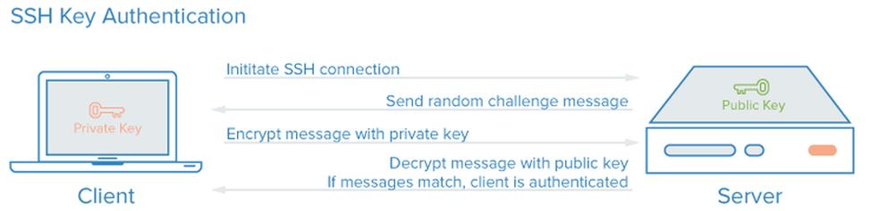

Authentifizierung über Public-Keys
----------------------------------

Laptop-Verbindung zu einem Server.

Quelle: How To Configure SSH Key-Based Authentication on a Linux Server

- - -

Wem die Authentifizierung über Passwörter trotz der Verschlüsselung zu unsicher ist, - immerhin könnte das Passwort ja erraten werden - der benutzt am besten das Public-Key-Verfahren. 

Hierbei wird asymmetrische Verschlüsselung genutzt, um den Benutzer zu authentifizieren. 

Der (oder die) öffentliche(n) Schlüssel des Benutzers befindet sich dabei in der Datei ~/.ssh/authorized_keys des Zielsystems, der private Schlüssel in einer Datei (meist id_rsa) im Verzeichnis ~/.ssh auf dem lokalen System, wo er zusätzlich von einer "pass phrase" geschützt wird. 

Wenn man sich nun mit der Public-Key-Methode auf einem SSH-Server anmelden möchte, so schickt der Server dem Klienten eine zufällig generierte Challenge. Der Klient verschlüsselt diesen Datenblock mit seinem privaten Schlüssel, (wofür nötigenfalls die Passphrase abgefragt wird,) und wenn der Server diesen Chiffre mit dem zugehörigen öffentlichen Schlüssel wieder entschlüsseln kann, ist die Identität des Benutzers bestätigt.

### Befehle

Damit man dieses Verfahren überhaupt verwenden kann, muss man sich zunächst mit Hilfe des Kommandozeilenprogramms ssh-keygen ein entsprechendes Schlüsselpaar erzeugen (ausprobieren z.B. in der web VM vom 060-User/mm Beispiel):

	vagrant ssh web
	sudo su - admin01
	# Key erstellen
	ssh-keygen -t rsa -b 4096 
	
Alternative, wenn root die Keys für die User erzeugen soll (z.B. in Vagranfile):

	su - admin01 -c "mkdir .ssh && chmod 700 .ssh && ssh-keygen -t rsa -f .ssh/id_rsa -b 4096 -C admin01@tbz.ch -P ''"

Nun muss noch der öffentliche Schlüssel, zu erkennen an der Endung .pub (id_rsa.pub), auf dem Zielsystem deponiert werden. Dazu dient das Programm ssh-copy-id. Zu diesem Zeitpunkt muss die Authentifizierung per Passwort noch erlaubt sein (PasswordAuthentication yes):

	ssh-copy-id -i ~/.ssh/id_rsa.pub admin01@db01 

Sollte ssh-copy-id nicht funktionieren, kann man den öffentlichen Schlüssel auch anders auf das Zielsystem kopieren und in die Datei ~/.ssh/authorized_keys einfügen. Dabei ist unbedingt darauf zu achten, dass die Datei mit der Endung .pub und nicht der private Schlüssel ohne diese Endung verwendet wird:

	cat id_rsa.pub | ssh db01 'cat>> ~/.ssh/authorized_keys' 

Anschließend kann man sich ohne Passwort anmelden:

	ssh admin01@db01 

### Links

* [Ubuntu Wiki](https://wiki.ubuntuusers.de/SSH/)
* [How To Configure SSH Key-Based Authentication on a Linux Server](https://www.digitalocean.com/community/tutorials/how-to-configure-ssh-key-based-authentication-on-a-linux-server)
* [how do you create an ssh key for another user?](http://serverfault.com/questions/323958/how-do-you-create-an-ssh-key-for-another-user)
* [6 nützliche Dinge, die man mit SSH tun kann](https://www.daniel-ritter.de/blog/6-nutzliche-dinge-die-man-mit-ssh-tun-kann)
