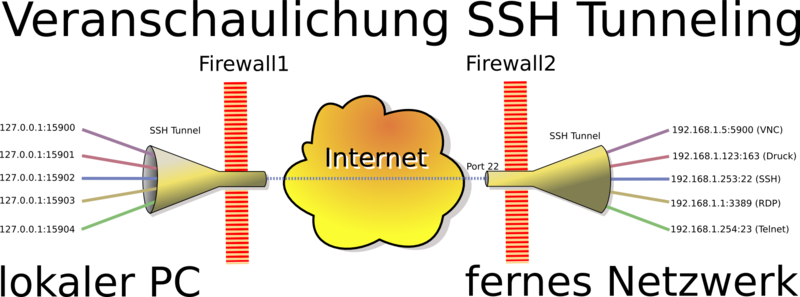

SSH-Tunnel
----------

Quelle: <a href="https://de.wikipedia.org/wiki/Tunnel_(Rechnernetz)">Wikipedia</a>

- - -

Tunnel bzw. Tunneling bezeichnet in einem Netzwerk die Konvertierung und Übertragung eines Kommunikationsprotokolls, das für den Transport in ein anderes Kommunikationsprotokoll eingebettet wird. 

Vor und hinter den Tunnelpartnern wird somit das ursprüngliche Protokoll „gesprochen“, während zwischen den Tunnelpartnern ein anderes Protokoll verwendet wird, das einer anderen Art der Kommunikation dient und dennoch die Daten des ursprünglichen Protokolls transportiert. 

Dafür wird die Tunnelsoftware auf beiden Seiten des Tunnels benötigt. Nachdem sie die ursprünglichen Kommunikationsdaten in ein anderes Protokoll eingebettet hat, muss die Software auf der jeweils anderen Seite des Tunnels die Daten wieder extrahieren und weiterreichen.

**Die Kommunikation im Tunnel erfolgt verschlüsselt!**

### Befehle (mit VMS aus 060-TCPIP/mm)

Weiterleitung von Port 8000 auf dem lokalen System (database/db01) an den Webserver web/web01 (192.168.55.101:80):

	cd 060-TCPIP/mm
	vagrant ssh database
	# Wechsel auf User admin01
	sudo su - admin01
	# in der VM
	ssh -L 8000:localhost:80 web01 -N &
	netstat -tulpen
	curl http://localhost:8000

Umgekehrte Richtung. Benutzern auf web/web01 wird ermöglicht, über localhost:3307 auf den MySQL-Server auf database/db01 zuzugreifen:

	vagrant ssh database
	# in der VM database
	ssh -R 3307:localhost:3306 web01 -N &
	ssh web01
	# in der VM web
	netstat -tulpen
	curl http://localhost:3307

	
**ACHTUNG:** Der db01 Server muss über einen Privaten SSH-Key verfügen und der Public SSH-Key muss in web01 eingetragen sein. Zusätzlich muss bereits einmal via `ssh` von db01 in den web01 Server gewechselt worden sein.
	
### Links

* [Ubuntu Wiki](https://wiki.ubuntuusers.de/SSH/)
* [SSH Tunnel Mit Linux](https://blog.ch-becker.de/2011/02/20/ssh-tunnel-mit-linux/)
* [Von innen durch die Firewall gegrabene Tunnel aufspüren](http://www.linux-magazin.de/Ausgaben/2008/11/Kein-Ausweg)
* [Kitchen Helper Beispiel](http://iotkit.mc-b.ch/2016-03-04-IoT-Orchestrierung/)
